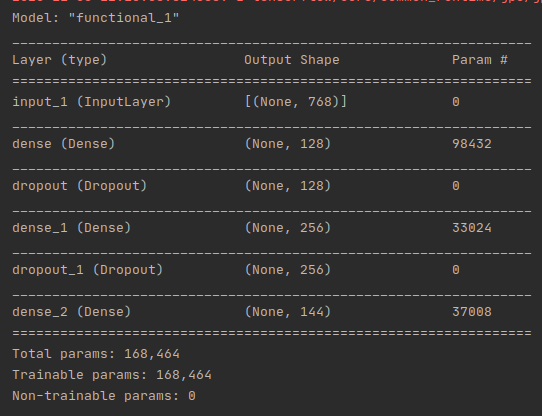
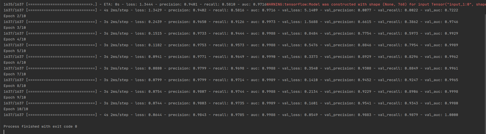

### TextClassification

#### Goal
1. Text Classification
2. Handle imabalanced dataset

#### Approach
1. A fresh trained embedding would not be possible on such a small dataset so going ahead with a pre-trained BERT model
2. Taking the last hidden state of the BERT model to get the embedding of the words
3. Using the word embeddings and then combining the words embeddings using mean accross the axis 1 to get a fixed length vector for all sentences
4. Because there are classes for which samples are very low, performing RandomOversampling to prevent overfitting and underfitting on the dataset.
5. Thus creating a sentence vector for each sentence of fixed length.
6. Feeding this sentence vector to a feed forward neural network for classification.

#### model architechture

#### Training Result

#### Further Improvement:
1. Instead of directly using BERT model fine tune it for our custom use case by:
  - rather than taking a mean on the axis one on every sentence embedding using the full embedding
  - Fixing the max lenght of each sentence
  - padding the shorter sentences
  - clipping the longer sentences
  - adding mask so that the attention is only done on the non padded part of the sentence or original sentence only
2. Using this 2D embedding to further use a Bi-LSTM for classification
